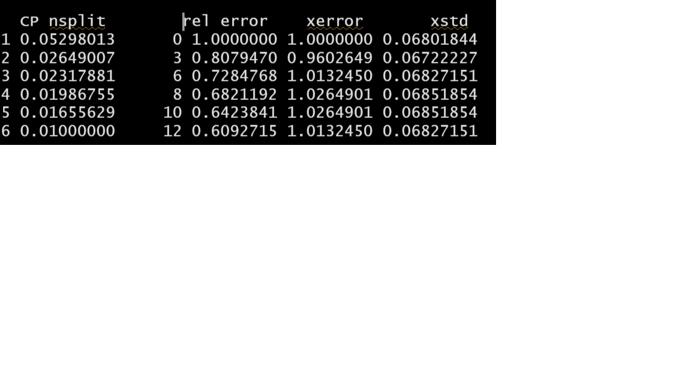
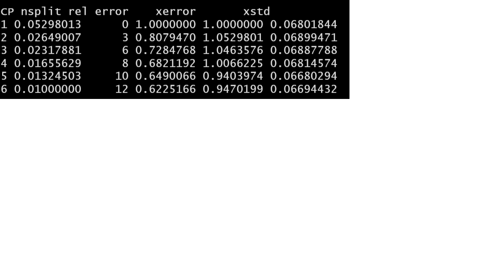
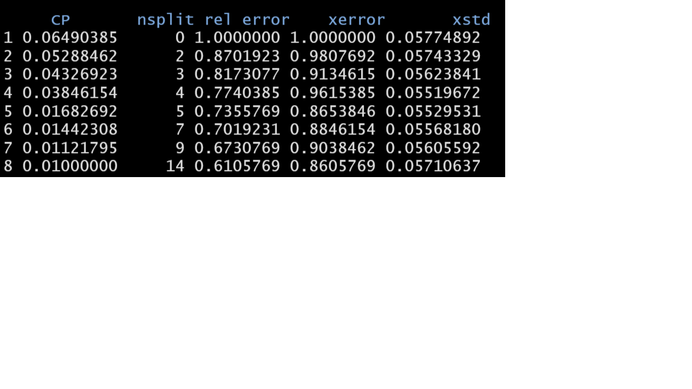
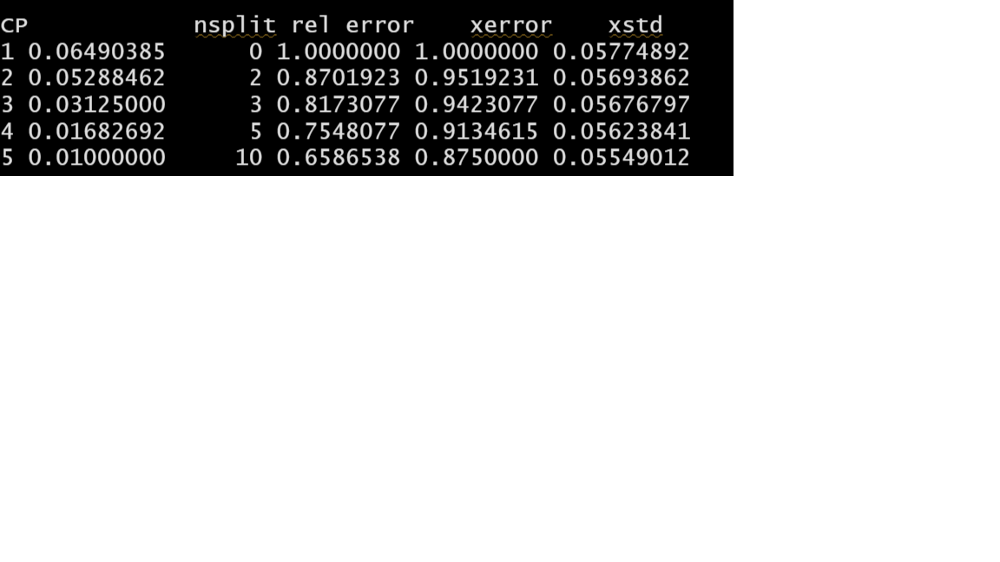
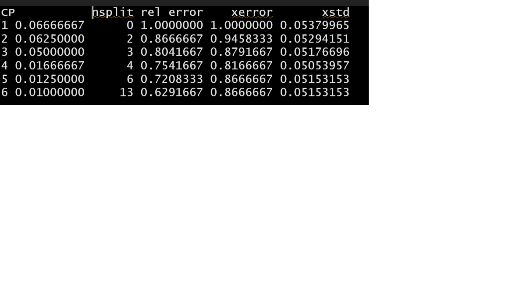
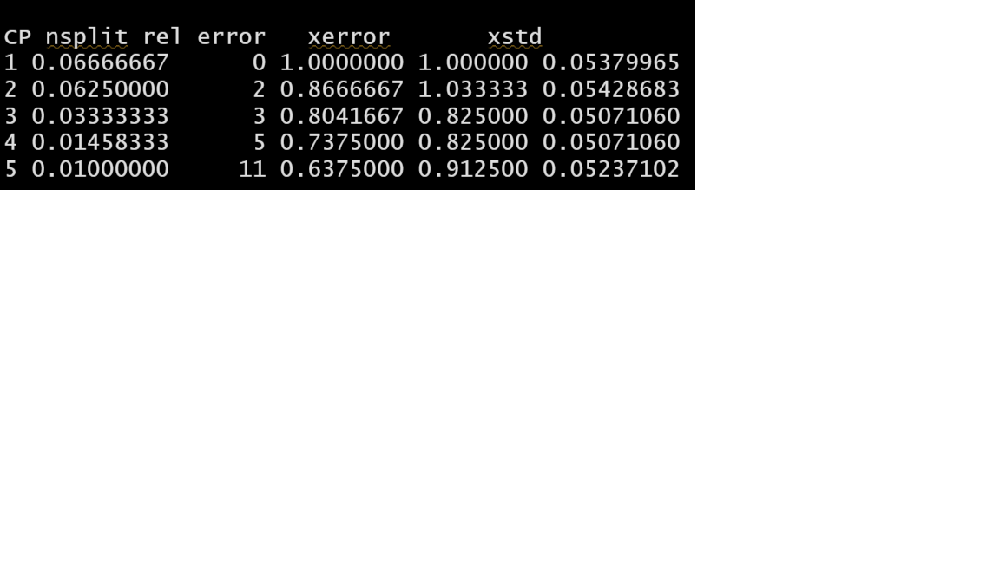
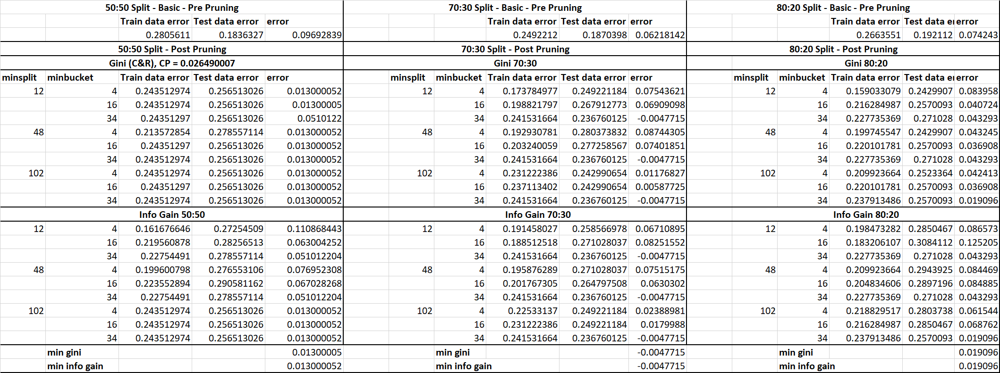

```{r setup, include=FALSE}
knitr::opts_chunk$set(echo = TRUE)
```
```{r,include=FALSE}
library("ltm")
library("readxl")
library("ggplot2")
library("ggcorrplot")
library("corrplot")
library("dplyr")
library("knitr")
library("psych")
library("funModeling")
library("caret")
library("gmodels")
library("rpart.plot")
library("rpart")
```
## Problem a) 

Reading data from the excel.
```{r}
data <- read_excel("German Credit.xls")
```


Exploring the data.
```{r}
str(data)

dim(data)

names(data)

summary(data)

head(data)
```

Finding the outliers in the numerical attributes.

Creating boxplots to identify the outliers.
```{r}
boxplot(data$DURATION)
boxplot(data$DURATION)$out

boxplot(data$AMOUNT)
boxplot(data$AMOUNT)$out

boxplot(data$INSTALL_RATE)
boxplot(data$INSTALL_RATE)$out

boxplot(data$AGE)
boxplot(data$AGE)$out

boxplot(data$NUM_CREDITS)
boxplot(data$NUM_CREDITS)$out

boxplot(data$NUM_DEPENDENTS)
boxplot(data$NUM_DEPENDENTS)$out
```
There are outliers observed. 
There are only two values in the 'NUM_DEPENDENTS' variable . Hence, ignoring this variable for the boxplot.


Proportion of good to bad cases.
```{r}
Good_Bad <-as.factor(ifelse(data$RESPONSE == 1, "Good", "Bad"))
tbl <- table(Good_Bad)
tbl_pct <- cbind(tbl,round(prop.table(tbl)*100,2))
colnames(tbl_pct) <- c('Count','Percentage')
knitr::kable(tbl_pct)
```


convert the required variables to categorical values.
```{r}
data$`OBS#` <- as.factor(data$`OBS#`)
data$CHK_ACCT <- as.factor(data$CHK_ACCT)
data$HISTORY <- as.factor(data$HISTORY)
data$NEW_CAR <- as.factor(data$NEW_CAR)
data$USED_CAR <- as.factor(data$USED_CAR)
data$FURNITURE <- as.factor(data$FURNITURE)
data$`RADIO/TV` <- as.factor(data$`RADIO/TV`)
data$EDUCATION <- as.factor(data$EDUCATION)
data$RETRAINING <- as.factor(data$RETRAINING)
data$SAV_ACCT <- as.factor(data$SAV_ACCT)
data$EMPLOYMENT <- as.factor(data$EMPLOYMENT)
data$MALE_DIV <- as.factor(data$MALE_DIV)
data$MALE_SINGLE <- as.factor(data$MALE_SINGLE)
data$MALE_MAR_or_WID <- as.factor(data$MALE_MAR_or_WID)
data$`CO-APPLICANT` <- as.factor(data$`CO-APPLICANT`)
data$GUARANTOR <- as.factor(data$GUARANTOR)
data$PRESENT_RESIDENT <- as.factor(data$PRESENT_RESIDENT)
data$REAL_ESTATE <- as.factor(data$REAL_ESTATE)
data$PROP_UNKN_NONE <- as.factor(data$PROP_UNKN_NONE)
data$OTHER_INSTALL <- as.factor(data$OTHER_INSTALL)
data$RENT <- as.factor(data$RENT)
data$OWN_RES <- as.factor(data$OWN_RES)
data$JOB <- as.factor(data$JOB)
data$TELEPHONE <- as.factor(data$TELEPHONE)
data$FOREIGN <- as.factor(data$FOREIGN)
```


Descriptions of the predictor (independent) variables - mean of numerical attributes and frequencies of categorical attributes.
```{r}
describe(data)
```


Standard deviation of numerical attributes.
```{r}
sd(data$DURATION)
sd(data$AMOUNT)
sd(data$INSTALL_RATE)
sd(data$AGE)
sd(data$NUM_CREDITS)
sd(data$NUM_DEPENDENTS)
```


Finding correlation between numerical variables and target variable - RESPONSE.
```{r}
cors <- cor(data[,(colnames(data) %in% c('DURATION', 'AMOUNT','INSTALL_RATE','AGE','NUM_CREDITS','NUM_DEPENDENTS'))], data[,ncol(data)])
kable(cors,col.names=c('RESPONSE'))

plot(data[,(colnames(data) %in% c('DURATION', 'AMOUNT','INSTALL_RATE','AGE','NUM_CREDITS','NUM_DEPENDENTS', 'RESPONSE'))])

corrplot::corrplot(cor(data$RESPONSE,data[,(colnames(data) %in% c('DURATION', 'AMOUNT','INSTALL_RATE','AGE','NUM_CREDITS','NUM_DEPENDENTS'))]))
```


Density Graphs - Finding correlation between numerical variables and target variable - RESPONSE.
```{r}
data$RESPONSE <- as.factor(data$RESPONSE)

ggplot(data)+
  geom_density(aes(x=DURATION,color=RESPONSE,fill=RESPONSE),alpha=0.5) + theme_classic()
```
The plot shows higher density of Good and Bad Response below 30 months, with a higher ratio of Good Response. The plot gradually reduced after 30 months, with a higher ratio of Bad Response.

```{r}
ggplot(data)+
  geom_density(aes(x=AMOUNT, color=RESPONSE,fill=RESPONSE),alpha=0.5) + theme_classic()
```
The plot shows higher density of Good and Bad Response below $5000, with a higher ratio of Good Response. The plot gradually reduces after $5000,  with a higher ratio of Bad Response.

```{r}
ggplot(data)+
  geom_density(aes(x=INSTALL_RATE, color=RESPONSE,fill=RESPONSE),alpha=0.5) + theme_classic()
```
The plot shows a similar trend between Good and Bad Responses.

```{r}
ggplot(data)+
  geom_density(aes(x=AGE, color=RESPONSE,fill=RESPONSE),alpha=0.5) + theme_classic()
```
The plot shows a similar trend between Good and Bad Responses. But Bad Responses are higher than Good Responses at the age of 30.

```{r}
ggplot(data)+
  geom_density(aes(x=NUM_CREDITS, color=RESPONSE,fill=RESPONSE),alpha=0.5) + theme_classic()
```
The plot shows a similar trend between Good and Bad Responses.

```{r}
ggplot(data)+
  geom_density(aes(x=NUM_DEPENDENTS, color=RESPONSE,fill=RESPONSE),alpha=0.5) + theme_classic()
```
The plot shows a similar trend between Good and Bad Responses.


Calculate chi-square values for categorical variables (Descending order of X-Squared, Higher = More important)
```{r}
chisq.test(data$CHK_ACCT, data$RESPONSE, correct=FALSE)        
chisq.test(data$HISTORY, data$RESPONSE, correct=FALSE)       
chisq.test(data$SAV_ACCT, data$RESPONSE, correct=FALSE)        
chisq.test(data$EMPLOYMENT, data$RESPONSE, correct=FALSE)      
chisq.test(data$OWN_RES, data$RESPONSE, correct=FALSE)   
chisq.test(data$PROP_UNKN_NONE, data$RESPONSE, correct=FALSE)  
chisq.test(data$REAL_ESTATE, data$RESPONSE, correct=FALSE)  
chisq.test(data$OTHER_INSTALL, data$RESPONSE, correct=FALSE)   
chisq.test(data$`RADIO/TV`, data$RESPONSE, correct=FALSE)      
chisq.test(data$NEW_CAR, data$RESPONSE, correct=FALSE)         
chisq.test(data$USED_CAR, data$RESPONSE, correct=FALSE)  
chisq.test(data$RENT, data$RESPONSE, correct=FALSE)            
chisq.test(data$MALE_SINGLE, data$RESPONSE, correct=FALSE)     
chisq.test(data$FOREIGN, data$RESPONSE, correct=FALSE)
chisq.test(data$EDUCATION, data$RESPONSE, correct=FALSE)       
chisq.test(data$`CO-APPLICANT`, data$RESPONSE, correct=FALSE)  
chisq.test(data$GUARANTOR, data$RESPONSE, correct=FALSE)       
chisq.test(data$MALE_DIV, data$RESPONSE, correct=FALSE)        
chisq.test(data$JOB, data$RESPONSE, correct=FALSE)             
chisq.test(data$RETRAINING, data$RESPONSE, correct=FALSE)      
chisq.test(data$TELEPHONE, data$RESPONSE, correct=FALSE) 
chisq.test(data$PRESENT_RESIDENT, data$RESPONSE, correct=FALSE)   
chisq.test(data$MALE_MAR_or_WID, data$RESPONSE, correct=FALSE) 
chisq.test(data$FURNITURE, data$RESPONSE, correct=FALSE)
```

Bar Graphs - Finding correlation between categorical variables and target variable - RESPONSE for important categorical values
```{r}
ggplot(data)+
  geom_bar(aes(x=CHK_ACCT,fill=RESPONSE)) + theme_classic()
```
Checking account type 2 (=> 200DM) has the lowest Responses. People with no checking account (type 4) has the highest Response with Higher Good Response.

```{r}
ggplot(data)+
  geom_bar(aes(x=HISTORY,fill=RESPONSE)) + theme_classic()
```
History type 0 (people who have no credits taken) and type 1 (all credits at this bank paid back duly) have equal Good and Bad Responses. 
History type 2 (existing credits paid back duly till now) have the highest Responses and have more Good Response than Bad.

```{r}
ggplot(data)+
  geom_bar(aes(x=SAV_ACCT,fill=RESPONSE)) + theme_classic()
```
Savings account type 0 ( < 100 DM) has the highest Response rate. It also has the highest density of Bad Responses among all other Savings Account Type.

```{r}
ggplot(data)+
  geom_bar(aes(x=EMPLOYMENT,fill=RESPONSE)) + theme_classic()
```
Employment type have similar Response Trends. Employment between 1 and 4 Years (Type 2) has the highest Response Rate.

```{r}
ggplot(data)+
  geom_bar(aes(x=EDUCATION,fill=RESPONSE)) + theme_classic()
```
There are higher Responses for Education = 0 than Education = 1.

```{r}
ggplot(data)+
  geom_bar(aes(x=OWN_RES,fill=RESPONSE)) + theme_classic()
```
There is a higher Response Rate when they own a resident (type = 1)

```{r}
ggplot(data)+
  geom_bar(aes(x=PROP_UNKN_NONE,fill=RESPONSE)) + theme_classic()
```
There is a higher Response Rate when they have a property.

```{r}
ggplot(data)+
  geom_bar(aes(x=REAL_ESTATE,fill=RESPONSE)) + theme_classic()
```
There is a higher Response Rate when they have real estate

```{r}
ggplot(data)+
  geom_bar(aes(x=OTHER_INSTALL,fill=RESPONSE)) + theme_classic()
```
There is a higher Response Rate when they don't have another installment plan credit.


The variables that are important to predict "good" and "bad" cases are:

Numerical variables:

AGE 
NUM_CREDITS 
NUM_DEPENDENTS

Categorical variables:

CHK_ACCT 
HISTORY 
SAV_ACCT 
EMPLOYMENT 
OWN_RES 
REAL_ESTATE 
OTHER_INSTALL 
RADIO/TV
USED_CAR 
NEW_CAR 
RENT


## Problem b) 

We are considering 'HIGH' for 'GOOD applicants' and 'LOW' for 'BAD applicants'

```{r}
names(data)[names(data) == 'OBS#'] <- 'OBS'
data <- subset(data, select = -c(OBS))
data$RESPONSE <- as.factor(ifelse(data$RESPONSE == 1,"HIGH","LOW"))
set.seed(96)
```

Model 1: Distributing the response variable values based on a 50% probability split.

Using the index function to assign 1 & 2 to the observations in the dataset named data.
```{r}
set.seed(96)
index <- sample(2, nrow(data), replace = T, prob = c(0.5,0.5))
```

selecting index 1 for training data
```{r}
train <- data[index == 1,]
```

selecting index 2 for training data
```{r}
test <- data[index == 2,]
```

Creating formula with all the variables using ., to serve as an input parameter to rpart.
```{r}
MyFormula = RESPONSE ~.

mytree_50_50_basic <- rpart(MyFormula, data=train)
print(mytree_50_50_basic)
```

Pre-Pruning : Decision tree based on 50:50 split
```{r}
rpart.plot(mytree_50_50_basic)
```

Predict function to predict the classes for the decision tree mytree_50_50_basic for training data.
```{r}
mytree_train_predict_50_50 <- predict(mytree_50_50_basic, data = train , type = "class")
```

Calculating the training error by comparing predicted classes with response variable of original dataset.
```{r}
mytree_train_error_50_50 <- mean(mytree_train_predict_50_50 != train$RESPONSE)
mytree_train_error_50_50
```

Predict function to predict the classes for the decision tree mytree_50_50 for testing data.
```{r}
mytree_test_predict_50_50 <- predict(mytree_50_50_basic, newdata = test, type = "class")
```

Calculating the testing error by comparing predicted classes with response variable of original dataset.
```{r}
mytree_test_error_50_50 <- mean(mytree_test_predict_50_50 != test$RESPONSE)
mytree_test_error_50_50
```

Calculating the performance of the model by finding the difference between the test error & train data.
```{r}
diff_50_50 = mytree_test_error_50_50 - mytree_train_error_50_50
print(diff_50_50)
```

```{r,include=FALSE}
summary(mytree_50_50_basic)
```
For gini split: Based on the summary command of the 50:50 split, below CP values are derived.

```{r}

```

############ APPLYING PARAMETER VALUES TO ARRIVE AT BETTER PERFORMANCE FOR 50-50 MODEL###############
Creating vectors for minsplit and minbucket values to be used for different combinations to test performance CP: 0.02649007 with least xerror of 0.9602649.

```{r}
msplt <- c(12,48,102)
mbckt <- c(4,16,34)

for (i in msplt)
  {
  for (j in mbckt)
{
    #Using rpart function to construct the decision tree based on training data,split on gini.  
mytree_50_50 <- rpart(MyFormula, data = train, parms = list(split="gini") ,control = rpart.control (minsplit = i,minbucket = j,cp=0.02649007))


#Print the decision tree.
#print(mytree_50_50)

#Predict function to predict the classes for the decision tree mytree_50_50 for training data.
mytree_train_predict_50_50 <- predict(mytree_50_50, data = train , type = "class")

#Display the values of the predicted classes of the decision mytree_50_50.
mytree_train_predict_50_50

#Calculating the training error by comparing predicted classes with response variable of original dataset. 
mytree_train_error_50_50 <- mean(mytree_train_predict_50_50 != train$RESPONSE)
mytree_train_error_50_50

#Predict function to predict the classes for the decision tree mytree_50_50 for testing data.
mytree_test_predict_50_50 <- predict(mytree_50_50, newdata = test, type = "class")
mytree_test_predict_50_50

#Calculating the testing error by comparing predicted classes with response variable of original dataset.
mytree_test_error_50_50 <- mean(mytree_test_predict_50_50 != test$RESPONSE)
mytree_test_error_50_50

#Calculating the performance of the model by finding the difference between the test error & train data.
diff_50_50 = mytree_test_error_50_50 - mytree_train_error_50_50

print(diff_50_50)
############################## Confusion Matrix for 50:50 Split #################################################

cfmt <- table(train$RESPONSE,mytree_train_predict_50_50)
print(cfmt)

fp = cfmt[2,1]
fn = cfmt[1,2]
tn = cfmt[2,2]
tp = cfmt[1,1]

#Calculating precision by dividing true positive with the sum of true positive and false positive.
precision_train =  (tp)/(tp+fp)
accuracymodel_train = (tp+tn)/(tp+tn+fp+fn)
recall_train = (tp)/(tp+fn)
fscore_train = (2*(recall_train*precision_train))/(recall_train+precision_train)
 


cfmt <- table(test$RESPONSE,mytree_test_predict_50_50)
print(cfmt)

fp = cfmt[2,1]
fn = cfmt[1,2]
tn = cfmt[2,2]
tp = cfmt[1,1]

#Calculating precision by dividing true positive with the sum of true positive and false positive.
precision_test =  (tp)/(tp+fp)
accuracymodel_test = (tp+tn)/(tp+tn+fp+fn)
recall_test = (tp)/(tp+fn)
fscore_test = (2*(recall_test*precision_test))/(recall_test + precision_test)

# Printing the values for train data error, test data error, performance and other parameters.
print(paste("Train data error: ", mytree_train_error_50_50))
print(paste("Test data error: ", mytree_test_error_50_50))
print(paste("Difference/performance", diff_50_50))
print(paste("precision of training data: ", precision_train))
print(paste("accuracy of training data: ", accuracymodel_train))
print(paste("recall of training data: ", recall_train))
print(paste("F-score of training data: ", fscore_train))
print(paste("precision of test data: ", precision_test))
print(paste("accuracy of test data: ", accuracymodel_test))
print(paste("recall of test data: ", recall_test))
print(paste("F-score of test data: ", fscore_test))
}
}
```

############################## 50-50 SPLIT DECISION TREE BASED ON INFORMATION GAIN###############
```{r}
mytree_50_50_basic <- rpart(MyFormula, data=train, parms = list(split="information"))
```

```{r,include=FALSE}
summary(mytree_50_50_basic)
```
Based on the summary command of the 50:50 split, below CP values are derived.

```{r}

```

############ APPLYING PARAMETER VALUES TO ARRIVE AT BETTER PERFORMANCE FOR information gain 50-50 MODEL###############
Creating vectors for minsplit and minbucket values to be used for different combinations to test performance CP: 0.01000000 with least xerror of 0.6225166.

```{r}
for (i in msplt)
{
  for (j in mbckt)
  {
    
#Constructing the decision tree based on information gain for 50-50 split
mytree_50_50_info <- rpart(MyFormula, data = train, parms = list(split="information"),control = rpart.control (minsplit = i,minbucket = j, cp= 0.01000000))

#print(mytree_50_50_info)

mytree_train_predict_50_50 <- predict(mytree_50_50_info, data = train , type = "class")

#Calculating the training error by comparing predicted classes with response variable of original dataset. 
mytree_train_error_50_50 <- mean(mytree_train_predict_50_50 != train$RESPONSE)
mytree_train_error_50_50

#Predict function to predict the classes for the decision tree mytree_50_50 for testing data.
mytree_test_predict_50_50 <- predict(mytree_50_50_info, newdata = test, type = "class")
mytree_test_predict_50_50

#Calculating the training error by comparing predicted classes with response variable of original dataset. 
mytree_test_error_50_50 <- mean(mytree_test_predict_50_50 != test$RESPONSE)
mytree_test_error_50_50

#Calculating the performance of the model by finding the difference between the test error & train data.
diff_50_50 = mytree_test_error_50_50 - mytree_train_error_50_50
print(diff_50_50)
cfmt <- table(train$RESPONSE,mytree_train_predict_50_50)
print(cfmt)

fp = cfmt[2,1]
fn = cfmt[1,2]
tn = cfmt[2,2]
tp = cfmt[1,1]

#Calculating precision by dividing true positive with the sum of true positive and false positive.
precision_train =  (tp)/(tp+fp)
accuracymodel_train = (tp+tn)/(tp+tn+fp+fn)
recall_train = (tp)/(tp+fn)
fscore_train = (2*(recall_train*precision_train))/(recall_train+precision_train)


cfmt <- table(test$RESPONSE,mytree_test_predict_50_50)
print(cfmt)

fp = cfmt[2,1]
fn = cfmt[1,2]
tn = cfmt[2,2]
tp = cfmt[1,1]

#Calculating precision by dividing true positive with the sum of true positive and false positive.
precision_test =  (tp)/(tp+fp)
accuracymodel_test = (tp+tn)/(tp+tn+fp+fn)
recall_test = (tp)/(tp+fn)
fscore_test = (2*(recall_test*precision_test))/(recall_test+precision_test)

# Printing the values for train data error, test data error, performance and other parameters.
print(paste("Train data error: ", mytree_train_error_50_50))
print(paste("Test data error: ", mytree_test_error_50_50))
print(paste("Difference/performance", diff_50_50))
print(paste("precision of training data: ", precision_train))
print(paste("accuracy of training data: ", accuracymodel_train))
print(paste("recall of training data: ", recall_train))
print(paste("F-score of training data: ", fscore_train))
print(paste("precision of test data: ", precision_test))
print(paste("accuracy of test data: ", accuracymodel_test))
print(paste("recall of test data: ", recall_test))
print(paste("F-score of test data: ", fscore_test))
}
}
```

######################## MODEL 2: 70:30 SPLIT #####################################################

```{r}
# Assigning 1 & 2 as index to split test and train data 
set.seed(96)
index <- sample(2, nrow(data), replace = T, prob = c(0.7,0.3))

#selecting index 1 for training
train <- data[index == 1,]

#selecting index 1 for testing
test <- data[index == 2,]

#Creating formula with all the response variables using ., to serve as an input parameter to rpart.
MyFormula = RESPONSE ~.

mytree_70_30_basic = rpart(MyFormula, data=train)
print(mytree_70_30_basic)

#Predict function to predict the classes for the decision tree mytree_70_30_basic for training data.
mytree_train_predict_70_30 <- predict(mytree_70_30_basic, data = train , type = "class")

#Calculating the training error by comparing predicted classes with response variable of original dataset. 
mytree_train_error_70_30 <- mean(mytree_train_predict_70_30 != train$RESPONSE)
mytree_train_error_70_30

#Predict function to predict the classes for the decision tree mytree_70_30 for testing data.
mytree_test_predict_70_30 <- predict(mytree_70_30_basic, newdata = test, type = "class")

#Calculating the testing error by comparing predicted classes with response variable of original dataset.
mytree_test_error_70_30 <- mean(mytree_test_predict_70_30 != test$RESPONSE)
mytree_test_error_70_30

#Calculating the performance of the model by finding the difference between the test error & train data.
diff_70_30 = mytree_test_error_70_30 - mytree_train_error_70_30

print(diff_70_30)
```
```{r,include=FALSE}
summary(mytree_70_30_basic)
```
Based on the summary command of the 70:30 split, below CP values are derived.

```{r}

```

############ APPLYING PARAMETER VALUES TO ARRIVE AT BETTER PERFORMANCE FOR 70-30 MODEL###############
Creating vectors for minsplit and minbucket values to be used for different combinations to test performance.
Based on summary ,using with CP = 0.01000000


```{r}
msplt <- c(12,48,102)
mbckt <- c(4,16,34)

for (i in msplt)
{
  for (j in mbckt)
  {
mytree_70_30 <- rpart(MyFormula, data = train,control = rpart.control (minsplit = i,minbucket = j, cp = 0.01000000))
#print(mytree_70_30)

mytree_train_predict_70_30 <- predict(mytree_70_30, data = train , type = "class")
#?predict
mytree_train_predict_70_30
mytree_train_error_70_30 <- mean(mytree_train_predict_70_30 != train$RESPONSE)
mytree_train_error_70_30

mytree_test_predict_70_30 <- predict(mytree_70_30, newdata = test, type = "class")
mytree_test_predict_70_30

mytree_test_error_70_30 <- mean(mytree_test_predict_70_30 != test$RESPONSE)
mytree_test_error_70_30

diff_70_30 = mytree_test_error_70_30 - mytree_train_error_70_30
diff_70_30
print(diff_70_30)

############################## Confusion Matrix for 70:30 Split #################################################

cfmt <- table(train$RESPONSE,mytree_train_predict_70_30)
print(cfmt)

fp = cfmt[2,1]
fn = cfmt[1,2]
tn = cfmt[2,2]
tp = cfmt[1,1]

#Calculating precision by dividing true positive with the sum of true positive and false positive.
precision_train =  (tp)/(tp+fp)
accuracymodel_train = (tp+tn)/(tp+tn+fp+fn)
recall_train = (tp)/(tp+fn)
fscore_train = (2*(recall_train*precision_train))/(recall_train+precision_train)


cfmt <- table(test$RESPONSE,mytree_test_predict_70_30)
print(cfmt)

fp = cfmt[2,1]
fn = cfmt[1,2]
tn = cfmt[2,2]
tp = cfmt[1,1]

#Calculating precision by dividing true positive with the sum of true positive and false positive.
precision_test =  (tp)/(tp+fp)
accuracymodel_test = (tp+tn)/(tp+tn+fp+fn)
recall_test = (tp)/(tp+fn)
fscore_test = (2*(recall_test*precision_test))/(recall_test+precision_test)

# Printing the values for train data error, test data error, performance and other parameters.
print(paste("Train data error: ", mytree_train_error_70_30))
print(paste("Test data error: ", mytree_test_error_70_30))
print(paste("Difference/performance", diff_70_30))
print(paste("precision of training data: ", precision_train))
print(paste("accuracy of training data: ", accuracymodel_train))
print(paste("recall of training data: ", recall_train))
print(paste("F-score of training data: ", fscore_train))
print(paste("precision of test data: ", precision_test))
print(paste("accuracy of test data: ", accuracymodel_test))
print(paste("recall of test data: ", recall_test))
print(paste("F-score of test data: ", fscore_test))
  }
}
```

############Constructing the decision tree based on information gain for 70-30 split
```{r}
mytree_70_30_basic = rpart(MyFormula, data=train,parms = list(split="information"))
```

```{r,include=FALSE}
summary (mytree_70_30_basic)
```

```{r}

```

We will choose the cp = 0.01000000 as that provides least xerror.

```{r}
for (i in msplt)
{
  for (j in mbckt)
  {
    
mytree_70_30_info <- rpart(MyFormula, data = train, parms = list(split="information"),control = rpart.control (minsplit = i,minbucket = j, cp=0.01000000))

#print(mytree_70_30_info)

mytree_train_predict_70_30 <- predict(mytree_70_30_info, data = train , type = "class")

#Calculating the training error by comparing predicted classes with response variable of original dataset. 
mytree_train_error_70_30 <- mean(mytree_train_predict_70_30 != train$RESPONSE)
mytree_train_error_70_30

#Predict function to predict the classes for the decision tree mytree_70_30 for testing data.
mytree_test_predict_70_30 <- predict(mytree_70_30_info, newdata = test, type = "class")
mytree_test_predict_70_30

#Calculating the training error by comparing predicted classes with response variable of original dataset. 
mytree_test_error_70_30 <- mean(mytree_test_predict_70_30 != test$RESPONSE)
mytree_test_error_70_30

#Calculating the performance of the model by finding the difference between the test error & train data.
diff_70_30 = mytree_test_error_70_30 - mytree_train_error_70_30

print(diff_70_30)

cfmt <- table(train$RESPONSE,mytree_train_predict_70_30)
print(cfmt)

fp = cfmt[2,1]
fn = cfmt[1,2]
tn = cfmt[2,2]
tp = cfmt[1,1]

#Calculating precision by dividing true positive with the sum of true positive and false positive.
precision_train =  (tp)/(tp+fp)
accuracymodel_train = (tp+tn)/(tp+tn+fp+fn)
recall_train = (tp)/(tp+fn)
fscore_train = (2*(recall_train*precision_train))/(recall_train+precision_train)


cfmt <- table(test$RESPONSE,mytree_test_predict_70_30)
print(cfmt)

fp = cfmt[2,1]
fn = cfmt[1,2]
tn = cfmt[2,2]
tp = cfmt[1,1]

#Calculating precision by dividing true positive with the sum of true positive and false positive.
precision_test =  (tp)/(tp+fp)
accuracymodel_test = (tp+tn)/(tp+tn+fp+fn)
recall_test = (tp)/(tp+fn)
fscore_test = (2*(recall_test*precision_test))/(recall_test+precision_test)

# Printing the values for train data error, test data error, performance and other parameters.
print(paste("Train data error: ", mytree_train_error_70_30))
print(paste("Test data error: ", mytree_test_error_70_30))
print(paste("Difference/performance", diff_70_30))
print(paste("precision of training data: ", precision_train))
print(paste("accuracy of training data: ", accuracymodel_train))
print(paste("recall of training data: ", recall_train))
print(paste("F-score of training data: ", fscore_train))
print(paste("precision of test data: ", precision_test))
print(paste("accuracy of test data: ", accuracymodel_test))
print(paste("recall of test data: ", recall_test))
print(paste("F-score of test data: ", fscore_test))
}
}
```

######################## MODEL 3: 80:20 SPLIT #####################################################

```{r}
# Assigning 1 & 2 as index to split test and train data 
set.seed(96)
index <- sample(2, nrow(data), replace = T, prob = c(0.8,0.2))

#selecting index 1 for training
train <- data[index == 1,]

#selecting index 1 for testing
test <- data[index == 2,]

#Creating formula with all the response variables using ., to serve as an input parameter to rpart.
MyFormula = RESPONSE ~.

mytree_80_20_basic = rpart(MyFormula, data=train)
print(mytree_80_20_basic)

#Predict function to predict the classes for the decision tree mytree_70_30_basic for training data.
mytree_train_predict_80_20 <- predict(mytree_80_20_basic, data = train , type = "class")

#Calculating the training error by comparing predicted classes with response variable of original dataset. 
mytree_train_error_80_20 <- mean(mytree_train_predict_80_20 != train$RESPONSE)
mytree_train_error_80_20

#Predict function to predict the classes for the decision tree mytree_80_20 for testing data.
mytree_test_predict_80_20 <- predict(mytree_80_20_basic, newdata = test, type = "class")

#Calculating the testing error by comparing predicted classes with response variable of original dataset.
mytree_test_error_80_20 <- mean(mytree_test_predict_80_20 != test$RESPONSE)
mytree_test_error_80_20

#Calculating the performance of the model by finding the difference between the test error & train data.
diff_80_20 = mytree_test_error_80_20 - mytree_train_error_80_20

print(diff_80_20)
```

```{r,include=FALSE}
summary(mytree_80_20_basic)
```
```{r}

```

############ APPLYING PARAMETER VALUES TO ARRIVE AT BETTER PERFORMANCE FOR 80-20 MODEL###############
Creating vectors for minsplit and minbucket values to be used for different combinations to test performance.
Based on above mentioned CP values,based on leaset xerror we will choose CP =  0.01000000 

```{r}
msplt <- c(12,48,102)
mbckt <- c(4,16,34)
for (i in msplt)
{
  for (j in mbckt)
  {

mytree_80_20 <- rpart(MyFormula, data = train, parms = list(split="gini"),control = rpart.control (minsplit = i,minbucket = j,cp=0.01000000))
#print(mytree_80_20)

mytree_train_predict_80_20 <- predict(mytree_80_20, data = train , type = "class")
?predict
mytree_train_predict_80_20
mytree_train_error_80_20 <- mean(mytree_train_predict_80_20 != train$RESPONSE)
mytree_train_error_80_20

mytree_test_predict_80_20 <- predict(mytree_80_20, newdata = test, type = "class")
mytree_test_predict_80_20

mytree_test_error_80_20 <- mean(mytree_test_predict_80_20 != test$RESPONSE)
mytree_test_error_80_20

diff_80_20 = mytree_test_error_80_20 - mytree_train_error_80_20
diff_80_20
print(diff_80_20)
  
############################## Confusion Matrix for 80:20 Split #################################################

cfmt <- table(train$RESPONSE,mytree_train_predict_80_20)
print(cfmt)

fp = cfmt[2,1]
fn = cfmt[1,2]
tn = cfmt[2,2]
tp = cfmt[1,1]

#Calculating precision by dividing true positive with the sum of true positive and false positive.
precision_train =  (tp)/(tp+fp)
accuracymodel_train = (tp+tn)/(tp+tn+fp+fn)
recall_train = (tp)/(tp+fn)
fscore_train = (2*(recall_train*precision_train))/(recall_train+precision_train)

cfmt <- table(test$RESPONSE,mytree_test_predict_80_20)
print(cfmt)

fp = cfmt[2,1]
fn = cfmt[1,2]
tn = cfmt[2,2]
tp = cfmt[1,1]

#Calculating precision by dividing true positive with the sum of true positive and false positive.
precision_test =  (tp)/(tp+fp)
accuracymodel_test = (tp+tn)/(tp+tn+fp+fn)
recall_test = (tp)/(tp+fn)
fscore_test = (2*(recall_test*precision_test))/(recall_test+precision_test)

# Printing the values for train data error, test data error, performance and other parameters.
print(paste("Train data error: ", mytree_train_error_80_20))
print(paste("Test data error: ", mytree_test_error_80_20))
print(paste("Difference/performance", diff_80_20))
print(paste("precision of training data: ", precision_train))
print(paste("accuracy of training data: ", accuracymodel_train))
print(paste("recall of training data: ", recall_train))
print(paste("F-score of training data: ", fscore_train))
print(paste("precision of test data: ", precision_test))
print(paste("accuracy of test data: ", accuracymodel_test))
print(paste("recall of test data: ", recall_test))
print(paste("F-score of test data: ", fscore_test))
  }}
```

```{r}
mytree_80_20_basic = rpart(MyFormula, data=train,parms = list(split="information"))
```

```{r}

```

Based on the above summary for information gain, the CP to be considered is 0.01000000 for least x error

```{r}
for (i in msplt)
{
  for (j in mbckt)
  {
#Constructing the decision tree based on information gain for 80-20 split
mytree_80_20_info <- rpart(MyFormula, data = train, parms = list(split="information"),control = rpart.control (minsplit = i,minbucket = j,cp=0.01000000))

#print(mytree_80_20_info)

mytree_train_predict_80_20 <- predict(mytree_80_20_info, data = train , type = "class")

#Calculating the training error by comparing predicted classes with response variable of original dataset. 
mytree_train_error_80_20 <- mean(mytree_train_predict_80_20 != train$RESPONSE)
mytree_train_error_80_20

#Predict function to predict the classes for the decision tree mytree_80_20 for testing data.
mytree_test_predict_80_20 <- predict(mytree_80_20_info, newdata = test, type = "class")
mytree_test_predict_80_20

#Calculating the training error by comparing predicted classes with response variable of original dataset. 
mytree_test_error_80_20 <- mean(mytree_test_predict_80_20 != test$RESPONSE)
mytree_test_error_80_20

#Calculating the performance of the model by finding the difference between the test error & train data.
diff_80_20 = mytree_test_error_80_20 - mytree_train_error_80_20
print(diff_80_20)

############################## Confusion Matrix for 80:20 Split #################################################

cfmt <- table(train$RESPONSE,mytree_train_predict_80_20)
print(cfmt)

fp = cfmt[2,1]
fn = cfmt[1,2]
tn = cfmt[2,2]
tp = cfmt[1,1]

#Calculating precision by dividing true positive with the sum of true positive and false positive.
precision_train =  (tp)/(tp+fp)
accuracymodel_train = (tp+tn)/(tp+tn+fp+fn)
recall_train = (tp)/(tp+fn)
fscore_train = (2*(recall_train*precision_train))/(recall_train+precision_train)


cfmt <- table(test$RESPONSE,mytree_test_predict_80_20)
print(cfmt)

fp = cfmt[2,1]
fn = cfmt[1,2]
tn = cfmt[2,2]
tp = cfmt[1,1]

#Calculating precision by dividing true positive with the sum of true positive and false positive.
precision_test =  (tp)/(tp+fp)
accuracymodel_test = (tp+tn)/(tp+tn+fp+fn)
recall_test = (tp)/(tp+fn)
fscore_test = (2*(recall_test*precision_test))/(recall_test+precision_test)


print(paste("Train data error: ", mytree_train_error_80_20))
print(paste("Test data error: ", mytree_test_error_80_20))
print(paste("Difference/performance", diff_80_20))
print(paste("precision of training data: ", precision_train))
print(paste("accuracy of training data: ", accuracymodel_train))
print(paste("recall of training data: ", recall_train))
print(paste("F-score of training data: ", fscore_train))
print(paste("precision of test data: ", precision_test))
print(paste("accuracy of test data: ", accuracymodel_test))
print(paste("recall of test data: ", recall_test))
print(paste("F-score of test data: ", fscore_test))
  }
}
```

```{r}

```


Que: Is there any specific model you would prefer to implement?

Prior to the pruning techniques, the 70:30 model provides the least error rate & high performance therefore, this model can be preferred. 

Que: Also, does pruning give a better model – please explain why or why not?

The 70:30 split model(post pruning, min split = 102, minbucket 4/16/34) can be implemented as this gives the least error and therefore best performance.

Que: Moreover this model performs similar on train and test data so that indicates the stability of the model.Do you see any performance differences across different types of decision tree learners?

Based on the above mentioned performance indicators based on minsplit, minbucket across information gain(C5.0) & gini(C&R) split, the performance values are consistent across both the methods.


## Problem c) 

We are considering 'HIGH' for 'GOOD applicants' and 'LOW' for 'BAD applicants'. From question b) 70-30 split is giving the best accuracy with least error. Hence, for question c) we are considering 70-30 split decision tree for missclassification cost analysis.

Assigning 1 & 2 as index to split test and train data.

Selected Variables = CHK_ACCT, HISTORY, SAV_ACCT, EMPLOYMENT,OWN_RES,REAL_ESTATE,
OTHER_INSTALL,USED_CAR, NEW_CAR,RENT
```{r}
set.seed(96)
index <- sample(2, nrow(data), replace = T, prob = c(0.7,0.3))
```

selecting index 1 for training
```{r}
train <- data[index == 1,]
```

selecting index 1 for testing
```{r}
test <- data[index == 2,]
```

Creating formula for all and selected values.
```{r}
MyFormula_allValues = RESPONSE ~ .
MyFormula_selectedValues = RESPONSE ~ CHK_ACCT + HISTORY  + SAV_ACCT + EMPLOYMENT + 
  OWN_RES + REAL_ESTATE + OTHER_INSTALL + USED_CAR + NEW_CAR + RENT
```

creating loss matrix with 1:5 ratio for TN:FP
```{r}
lossMatrix <- matrix(c(0, 1, 5, 0), byrow=TRUE, ncol=2)
lossMatrix
```

Creating three trees to analyze misscalssification cost 
     1) Without adding Loss and All Variables
     2) With adding Loss and All Variables
     3) With adding Loss and Selected Variables
     
```{r}
mytree_wol <- rpart(MyFormula_allValues, data = train)
mytree_wl_av <- rpart(MyFormula_allValues, data = train, parms = list(loss=lossMatrix))
mytree_wl_sv <- rpart(MyFormula_selectedValues, data = train, parms = list(loss=lossMatrix))
```   

Train data for Tree Without Loss and All values.
```{r}
mytree_wol_pTr <- predict(mytree_wol, data = train , type = "class")
cf_wol_tr<-table(actual = train$RESPONSE, pred = mytree_wol_pTr)
cf_wol_tr

cf_wol_tr_accuracy<-(cf_wol_tr[1,1]+cf_wol_tr[2,2])/ (cf_wol_tr[1,1]+cf_wol_tr[1,2]+cf_wol_tr[2,1]+cf_wol_tr[2,2])
cf_wol_tr_error<- 1 - cf_wol_tr_accuracy
cf_wol_tr_precision<-(cf_wol_tr[1,1]/(cf_wol_tr[1,1]+cf_wol_tr[2,1]))
```   


Train data for Tree With Loss and All values.
```{r}
mytree_wl_av_pTr <- predict(mytree_wl_av, data = train , type = "class")
cf_wl_av_tr<-table(actual = train$RESPONSE, pred = mytree_wl_av_pTr)
cf_wl_av_tr

cf_wl_av_tr_accuracy<-(cf_wl_av_tr[1,1]+cf_wl_av_tr[2,2])/ (cf_wl_av_tr[1,1]+cf_wl_av_tr[1,2]+cf_wl_av_tr[2,1]+cf_wl_av_tr[2,2])
cf_wl_av_tr_error<- 1 - cf_wl_av_tr_accuracy
cf_wl_av_tr_precision<-(cf_wl_av_tr[1,1]/(cf_wl_av_tr[1,1]+cf_wl_av_tr[2,1]))
``` 

Train data for Tree With Loss and selected values.
```{r}
mytree_wl_sv_pTr <- predict(mytree_wl_sv, data = train , type = "class")
cf_wl_sv_tr<-table(actual = train$RESPONSE, pred = mytree_wl_sv_pTr)
cf_wl_sv_tr

cf_wl_sv_tr_accuracy<-(cf_wl_sv_tr[1,1]+cf_wl_sv_tr[2,2])/ (cf_wl_sv_tr[1,1]+cf_wl_sv_tr[1,2]+cf_wl_sv_tr[2,1]+cf_wl_sv_tr[2,2])
cf_wl_sv_tr_error<- 1 - cf_wl_sv_tr_accuracy
cf_wl_sv_tr_precision<-(cf_wl_sv_tr[1,1]/(cf_wl_sv_tr[1,1]+cf_wl_sv_tr[2,1]))


df_tr <- data.frame(TreeType = c("Tree Without Loss All Variables", "Tree With Loss All Variables", "Tree With Loss Selected Variables"),
                 Accuracy = c(round(cf_wol_tr_accuracy,digits =2), round(cf_wl_av_tr_accuracy,digits =2), round(cf_wl_sv_tr_accuracy,digits =2)),
                 Error = c(round(cf_wol_tr_error,digits =2), round(cf_wl_av_tr_error,digits =2), round(cf_wl_sv_tr_error,digits =2)),
                 Precision = c(round(cf_wol_tr_precision,digits =2), round(cf_wl_av_tr_precision,digits =2), round(cf_wl_sv_tr_precision,digits =2))
)
``` 


Test data for Tree Without Loss and All values.
```{r}
mytree_wol_pTs <- predict(mytree_wol, newdata = test , type = "class")
cf_wol_ts<-table(actual = test$RESPONSE, pred = mytree_wol_pTs)
cf_wol_ts

cf_wol_ts_accuracy<-(cf_wol_ts[1,1]+cf_wol_ts[2,2])/ (cf_wol_ts[1,1]+cf_wol_ts[1,2]+cf_wol_ts[2,1]+cf_wol_ts[2,2])
cf_wol_ts_error<- 1 - cf_wol_ts_accuracy
cf_wol_ts_precision<-(cf_wol_ts[1,1]/(cf_wol_ts[1,1]+cf_wol_ts[2,1]))
``` 


Test data for Tree With Loss and All values.
```{r}
mytree_wl_av_pTs <- predict(mytree_wl_av, newdata = test , type = "class")
cf_wl_av_ts<-table(actual = test$RESPONSE, pred = mytree_wl_av_pTs)
cf_wl_av_ts

cf_wl_av_ts_accuracy<-(cf_wl_av_ts[1,1]+cf_wl_av_ts[2,2])/ (cf_wl_av_ts[1,1]+cf_wl_av_ts[1,2]+cf_wl_av_ts[2,1]+cf_wl_av_ts[2,2])
cf_wl_av_ts_error<- 1 - cf_wl_av_ts_accuracy
cf_wl_av_ts_precision<-(cf_wl_av_ts[1,1]/(cf_wl_av_ts[1,1]+cf_wl_av_ts[2,1]))
``` 


Test data for Tree With Loss and Selected values.
```{r}
mytree_wl_sv_pTs <- predict(mytree_wl_sv, newdata = test , type = "class")
cf_wl_sv_ts<-table(actual = test$RESPONSE, pred = mytree_wl_sv_pTs)
cf_wl_sv_ts


cf_wl_sv_ts_accuracy<-(cf_wl_sv_ts[1,1]+cf_wl_sv_ts[2,2])/ (cf_wl_sv_ts[1,1]+cf_wl_sv_ts[1,2]+cf_wl_sv_ts[2,1]+cf_wl_sv_ts[2,2])
cf_wl_sv_ts_error<- 1 - cf_wl_sv_ts_accuracy
cf_wl_sv_ts_precision<-(cf_wl_sv_ts[1,1]/(cf_wl_sv_ts[1,1]+cf_wl_sv_ts[2,1]))


df_ts <- data.frame(TreeType = c("Tree Without Loss All Variables", "Tree With Loss All Variables", "Tree With Loss Selected Variables"),
                 Accuracy = c(round(cf_wol_ts_accuracy,digits =2), round(cf_wl_av_ts_accuracy,digits =2), round(cf_wl_sv_ts_accuracy,digits =2)),
                 Error = c(round(cf_wol_ts_error,digits =2), round(cf_wl_av_ts_error,digits =2), round(cf_wl_sv_ts_error,digits =2)),
                 Precision = c(round(cf_wol_ts_precision,digits =2), round(cf_wl_av_ts_precision,digits =2), round(cf_wl_sv_ts_precision,digits =2))
)
``` 

On training data:
```{r}
print(df_tr)
``` 


On test data
```{r}
print(df_ts)
``` 
Yes, there are changes in the model/performance.

We can see a decrease in the Accuracy and increase in the Precision (Decrease in FALSE POSITIVE cases)

Benefits from specifying missclassification costs:
Avoid FALSE POSITIVE cases (incorrectly saying an applicant is good credit risk)


Printing the decision tree with adding Loss and Selected Variables. As the precision is maximum in this case.
```{r}
mytree_wl_sv
rpart.plot(mytree_wl_sv)
``` 


## Problem d) 

From the tree in question c, we can derive the following decision rules for "Good" applicants.

1) If CHK_ACCT equals 2 or 3 AND OTHER_INSTLL equals 0 AND HISTORY equals 1 or 4 THEN 'GOOD Applicant'
2) If CHK_ACCT equals 2 or 3 AND OTHER_INSTLL equals 0 AND HISTORY is not equal to 1 or 4 AND EMPLOYEMENT equals 3 or 4 THEN 'GOOD Applicant'

The above decision rules are chosen on the basis of having highest confidence value among all the other rules.


## Problem e)

Findings for Problem b):
```{r}
rpart.plot(mytree_70_30)
``` 

We are choosing the above decision tree as this provides the best performance which can be attributed to the difference between the training and testing error derived over various minsplit and minbucket values.


Findings for Problem c):

Our approach includes calculation of accuracy, error and precision of the below three trees
     1) Without adding Loss and All Variables
     2) With adding Loss and All Variables
     3) With adding Loss and important Variables

We are considering precision because we want to reduce the False Positive (incorrectly saying an applicant is good credit risk) cases. 

Precision = True Positive/(True Positive + False Positive)

On Training Data:
```{r}
print(df_tr)
``` 
In the above table, it is observed that, the accuracy without loss matrix is highest among all i.e 81% and its corresponding precision value is 84%.

In our case, it is important to INCREASE the precision i.e. lesser FALSE POSITIVE cases. So we consider the tree by adding loss.

After adding loss, it is observed that the Accuracy has decreased and Precision has increased. This is a trade-off that we have to consider.


